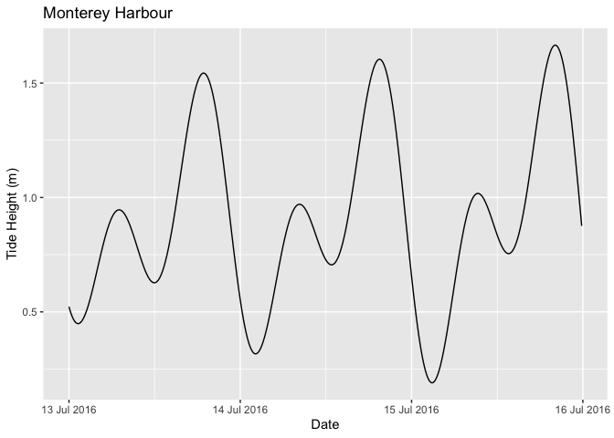

# rtide

## Introduction

`rtide` is an R package to calculate tide heights based on tide station
harmonics.

It includes the harmonics data for 637 US stations.

## Installation

To install the latest release from [CRAN](https://cran.r-project.org)

``` r

install.packages("rtide")
```

To install the developmental version from
[GitHub](https://github.com/millerlp/rtide)

``` r

# install.packages("pak")
pak::pak("millerlp/rtide")
```

## Utilisation

``` r

library(tibble)
library(rtide)
#> rtide is not suitable for navigation

data <- rtide::tide_height(
  "Monterey Harbor",
  from = as.Date("2016-07-13"), to = as.Date("2016-07-15"),
  minutes = 10L, tz = "America/Los_Angeles"
)

print(data)
#> # A tibble: 432 × 3
#>    Station                               DateTime            TideHeight
#>    <chr>                                 <dttm>                   <dbl>
#>  1 Monterey, Monterey Harbor, California 2016-07-13 00:00:00      0.514
#>  2 Monterey, Monterey Harbor, California 2016-07-13 00:10:00      0.496
#>  3 Monterey, Monterey Harbor, California 2016-07-13 00:20:00      0.481
#>  4 Monterey, Monterey Harbor, California 2016-07-13 00:30:00      0.468
#>  5 Monterey, Monterey Harbor, California 2016-07-13 00:40:00      0.457
#>  6 Monterey, Monterey Harbor, California 2016-07-13 00:50:00      0.449
#>  7 Monterey, Monterey Harbor, California 2016-07-13 01:00:00      0.443
#>  8 Monterey, Monterey Harbor, California 2016-07-13 01:10:00      0.440
#>  9 Monterey, Monterey Harbor, California 2016-07-13 01:20:00      0.439
#> 10 Monterey, Monterey Harbor, California 2016-07-13 01:30:00      0.441
#> # ℹ 422 more rows
```

``` r

library(ggplot2)
library(scales)
```

``` r

ggplot(data = data, aes(x = DateTime, y = TideHeight)) +
  geom_line() +
  scale_x_datetime(
    name = "Date",
    labels = date_format("%d %b %Y", tz = "America/Los_Angeles")
  ) +
  scale_y_continuous(name = "Tide Height (m)") +
  ggtitle("Monterey Harbour")
```



## Shiny

Tide heights can be also obtained using rtide through a [shiny
interface](https://poissonconsulting.shinyapps.io/rtide/) developed by
Seb Dalgarno.

## Contribution

Please report any [issues](https://github.com/millerlp/rtide/issues).

[Pull requests](https://github.com/millerlp/rtide/pulls) are always
welcome.

## Inspiration

The harmonics data was converted from
<https://github.com/poissonconsulting/rtide/blob/main/data-raw/harmonics-dwf-20151227-free.tar.bz2>,
NOAA web site data processed by David Flater for
[`XTide`](https://flaterco.com/xtide/). The code to calculate tide
heights from the harmonics is based on `XTide`.
